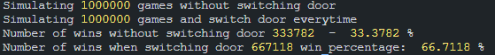

# Monty Hall problem

This script is meant to test the probability monty hall problem.

A problem in which Monty Hall (a TV show host) is presenting a set of 3 doors.
One of them hides a car, the other two hide a goat.

You are meant to pick one in order to win the car.
If you pick a door with a goat behind it, you lose.

But right after picking a door, Monty Hall opens one of the other two doors, revealing a goat behind it.

You then have a choice, stick to your door or pick the other one.

The probability says that switching door would be a better choice, but is it really true ?

### Spoiler: yes it is



The more games you simulate, the more you get to a perfect 33.33% of wins withoug switching door, and 66.66% wins when switching door.

# Executing the script

You need NodeJS >=v14. No library needed.

```sh
node index.mjs
```

You can change the number of execution by updating the NUMBER_EXECUTIONS variable at the top of the index.mjs file.
